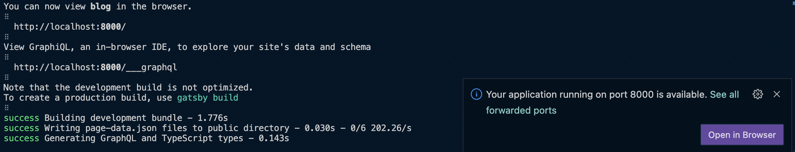
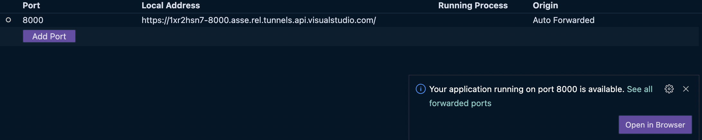

얼마전 `VS Code Server Preview`가 가능하다는 메일을 받았습니다.  
대략적인 개념은 서버(로컬 개발 장비 등)에 원격 접속하여 브라우저 상에서 개발이 가능 하다는 것이고, 때문에 브라우저만 사용할 수 있으면 ~~로컬만큼은 아니지만~~ 어디에서든 개발이 가능해 졌습니다.

## 설치

Linux / MacOS 의 경우 아래 명령어만 쉘에서 실행하면 간단하게 설치가 됩니다.  
실행 파일은 `/usr/local/bin` 에 추가됩니다.
```shell
wget -O- https://aka.ms/install-vscode-server/setup.sh | sh
```

## 서버 실행

1. 아래에 명령어를 실행하여 서버를 실행 할 수 있습니다.
```shell
code-server
```

2. 서버를 실행하면 GitHub Account 인증을 하게 됩니다.
```shell
Please enter the code 1234-1234 on https://github.com/login/device
```

3. 현재 머신의 이름을 묻는데, 입력한 이름(별칭)을 이용하여 머신에 접속 할 수 있습니다.
```shell
? What would you like to call this machine? (myname-macbook-air) >
```

4. 설정이 완료되면 접속 주소가 표시되고 브라우저를 통해서 접속하면 됩니다.
```shell
Open this link in your browser https://insiders.vscode.dev/+ms-vscode.remote-server/myname-macbook-air
```

## 원격 접속
원격에서 브라우저를 통해 위의 주소로 접속을 시도하면 익숙한 `VS Code`를 브라우저 상에서 볼 수 있습니다.
다만 소스 코드 저장 및 실행은 `code-server`가 실행되고 있는 원격 머신에서 이루어집니다.

기존에 개발 중인 Gatsby 프로젝트를 실행해 보겠습니다.  
8000번 포트로 실행이 되는데 로컬이 아니기 때문에 외부에서는 접근할 방법이 없습니다.  
그런데 `code-server`가 똑똑하게 외부에서 접속 할 수 있는 터널링한 주소를 자동으로 부여해 줍니다.



팝업을 클릭하면 원격 접속 가능한 포트별 주소를 확인 할 수 있습니다.



이제 브라우저만 있다면 어디에서든 코딩이 가능합니다! (심지어 iPad 에서도..)
